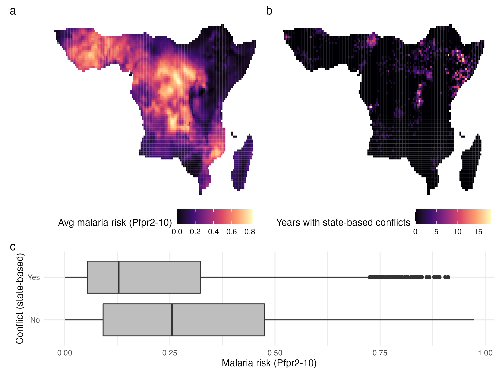
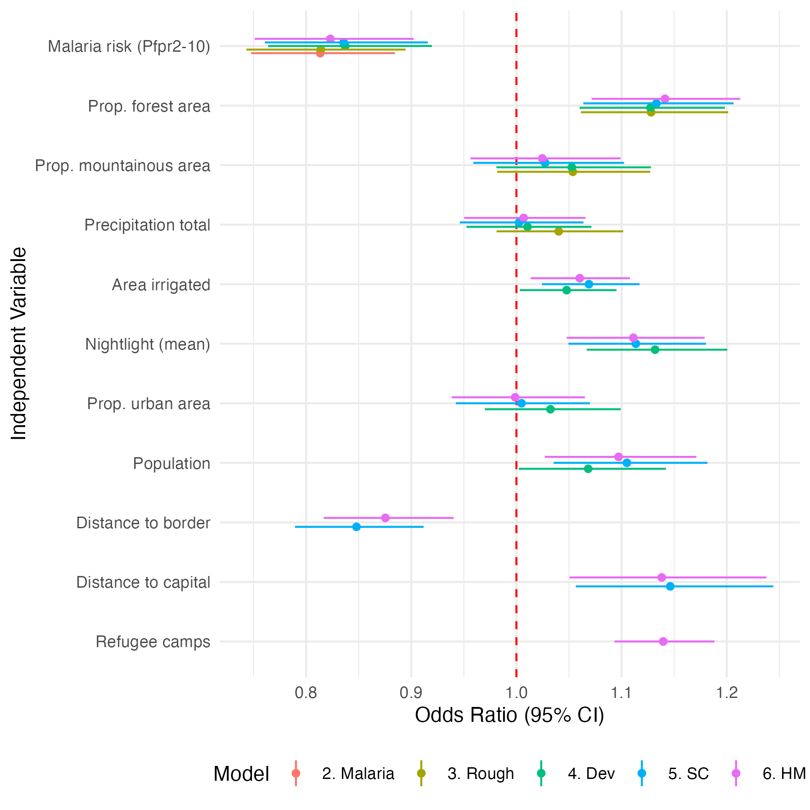
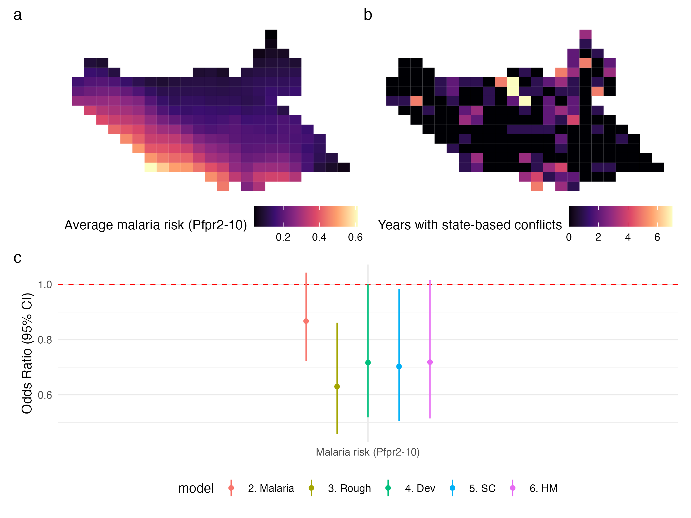

```{r setup, include=FALSE}
knitr::opts_chunk$set(warning=FALSE, message=FALSE, 
                      fig.align='center', fig.width = 5, fig.height=4,
                      out.width = "80%")
```

## Load Packages

```{r}
library(tidyverse)
theme_set(theme_minimal())
library(patchwork)
library(MASS)
library(sjPlot)
library(texreg)

# install.packages("https://cran.r-project.org/src/contrib/Archive/Zelig/Zelig_4.2-1.tar.gz", 
#                  repos=NULL, 
#                  type="source")
# install.packages("sandwich")
library(Zelig)
```

## Load Data

```{r}
d <- read_rds("Replication_Data.rds")
```

## Figure 1: Spatial distribution of state-based conflicts and malaria risk

```{r, width = 10, height = 8}
p1 <- d %>%
  group_by(`Grid ID`, Lon, Lat) %>%
  summarise(`Avg malaria risk (Pfpr2-10)` = mean(`Malaria risk (Pfpr2-10)`)) %>%
  ggplot(aes(x = Lon, y = Lat, fill = `Avg malaria risk (Pfpr2-10)`)) +
  geom_tile() +
  scale_fill_viridis_c(option = "A") +
  theme_void() +
  theme(legend.position = "bottom")

p2 <- d %>%
  group_by(`Grid ID`, Lon, Lat) %>%
  summarise(`Years with state-based conflicts` = sum(`Conflicts occurrence (state-based)`)) %>%
  ggplot(aes(x = Lon, y = Lat, fill = `Years with state-based conflicts`)) +
  geom_tile() +
  scale_fill_viridis_c(option = "A") +
  theme_void() +
  theme(legend.position = "bottom")

p3 <- d %>%
  mutate(`Conflict (state-based)` = ifelse(`Conflicts occurrence (state-based)` == 1, "Yes", "No")) %>%
  ggplot(aes(x = `Conflict (state-based)`, y = `Malaria risk (Pfpr2-10)`)) +
  geom_boxplot(fill = 'grey') +
  coord_flip()

p_merge <- (p1 | p2) / p3 + 
  plot_layout(height = c(2, 1)) + plot_annotation(tag_levels = "a")

dir.create("Out_Figures_Tables/")
ggsave("Out_Figures_Tables/Figure_1.png", width = 8, height = 6)

```



## Calculate Spatial Lag

```{r}
source("Helper/calculate_spatial_lag.R")
```

## Table 1 and A1

Note: As discussed in the article, Table 1 contains highlights of Table A1. It is not directly generated from code. The code below generates Table A1.

```{r, results='hide'}
# Prepare data for statistical analysis
source("Helper/prepare_data_for_regression.R")

# Run regressions
DV <- "Conflicts occurrence (state-based)"
EV <- "Malaria risk (Pfpr2-10)"
source("Helper/fit_models_logit.R")
```

```{r, results='asis'}
# Make summary table
htmlreg(models, omit.coef = "Country|Year",
        caption = sprintf("%s ~ %s", DV, EV),
        caption.above = TRUE,
        stars = c(0.01, 0.05, 0.10),
        booktabs = TRUE,
        custom.model.names = names(models),
        file = "Out_Figures_Tables/Table_1_A1.html"
)

htmlreg(models, omit.coef = "Country|Year",
        caption = sprintf("%s ~ %s", DV, EV),
        caption.above = TRUE,
        stars = c(0.01, 0.05, 0.10),
        booktabs = TRUE,
        custom.model.names = names(models)
)
```


# Figure 2

```{r, fig.width=6, fig.height=6}
var_select <- c("Malaria risk (Pfpr2-10)", 
                "Prop. forest area", "Prop. mountainous area", 
                "Precipitation total", "Area irrigated",
                "Nightlight (mean)", "Prop. urban area", "Population",
                "Distance to border", "Distance to capital",
                "Refugee camps")

ci_df_s <- ci_df %>%
  mutate(variable = str_remove_all(variable, "`")) %>%
  filter(variable %in% var_select) %>%
  mutate(variable = factor(variable, 
                           levels = rev(var_select)))
  
p <- ci_df_s %>%
  rename("Model" = "model") %>%
  ggplot(aes(color = Model)) +
  geom_hline(yintercept=1, linetype = "dashed", color = "red") +
  geom_point(aes(y = `50%`, x = variable), position=position_dodge(width=0.3)) +
  geom_linerange(aes(x = variable, ymin = `2.5%`, ymax = `97.5%`), 
                 position=position_dodge(width=0.3)) +
  ylab("Odds Ratio (95% CI)") + xlab("Independent Variable") +
  coord_flip() +
  theme_minimal() +
  theme(legend.position = "bottom")

ggsave("Out_Figures_Tables/Figure_2.png", plot = p, width = 6, height = 6)
```



## Figure 3

```{r, results='hide'}
# Prepare Data
source("Helper/prepare_data_for_regression_south_sudan.R")

# Fit models with South Sudan subset
DV <- "Conflicts occurrence (state-based)"
EV <- "Malaria risk (Pfpr2-10)"
source("Helper/fit_models_logit_south_sudan.R")
```


```{r}
p1 <- d %>%
  filter(Country == "South Sudan") %>%
  group_by(`Grid ID`, Lon, Lat) %>%
  summarise(`Average malaria risk (Pfpr2-10)` = mean(`Malaria risk (Pfpr2-10)`)) %>%
  ggplot(aes(x = Lon, y = Lat, fill = `Average malaria risk (Pfpr2-10)`)) +
  geom_tile() +
  scale_fill_viridis_c(option = "A") +
  theme_void() +
  theme(legend.position = "bottom")

p2 <- d %>%
  group_by(`Grid ID`, Lon, Lat) %>%
  filter(Country == "South Sudan") %>%
  summarise(`Years with state-based conflicts` = sum(`Conflicts occurrence (state-based)`)) %>%
  ggplot(aes(x = Lon, y = Lat, fill = `Years with state-based conflicts`)) +
  geom_tile() +
  scale_fill_viridis_c(option = "A") +
  theme_void() +
  theme(legend.position = "bottom")

var_select <- c("Malaria risk (Pfpr2-10)")

ci_df_s <- ci_df %>%
  mutate(variable = str_remove_all(variable, "`")) %>%
  filter(variable %in% var_select) %>%
  mutate(variable = factor(variable,
                           levels = rev(var_select)))

p3 <- ci_df_s %>%
  ggplot(aes(color = model)) +
  geom_hline(yintercept=1, linetype = "dashed", color = "red") +
  geom_point(aes(y = `50%`, x = variable), position=position_dodge(width=0.3)) +
  geom_linerange(aes(x = variable, ymin = `2.5%`, ymax = `97.5%`),
                 position=position_dodge(width=0.3)) +
  ylab("Odds Ratio (95% CI)") + xlab("Independent Variable") +
  theme_minimal() +
  theme(legend.position = "bottom") +
  theme(axis.title.x = element_blank())

p_merge <- (p1 | p2) / p3 + plot_annotation(tag_levels = "a")

ggsave("Out_Figures_Tables/Figure_3.png", plot = p_merge, width = 8, height = 6)
```




## Table A2: Removing Temporal Lags

```{r, results='hide'}
# Prepare data for statistical analysis
source("Helper/prepare_data_for_regression.R")

# Run regressions
DV <- "Conflicts occurrence (state-based)"
EV <- "Malaria risk (Pfpr2-10)"
source("Helper/fit_models_logit_wo_tlag.R")
```

```{r, results='asis'}
# Make summary table
htmlreg(models, omit.coef = "Country|Year",
        caption = sprintf("%s ~ %s", DV, EV),
        caption.above = TRUE,
        stars = c(0.01, 0.05, 0.10),
        booktabs = TRUE,
        custom.model.names = names(models),
        file = "Out_Figures_Tables/Table_A2.html"
)

htmlreg(models, omit.coef = "Country|Year",
        caption = sprintf("%s ~ %s", DV, EV),
        caption.above = TRUE,
        stars = c(0.01, 0.05, 0.10),
        booktabs = TRUE,
        custom.model.names = names(models)
)
```

## Table A3: Rare Event Logistic Regression

```{r, results='hide'}
# Prepare data for statistical analysis
source("Helper/prepare_data_for_regression.R")

# Run regressions
DV <- "Conflicts occurrence (state-based)"
EV <- "Malaria risk (Pfpr2-10)"
source("Helper/fit_models_relogit.R")
```

```{r, results='asis'}
# Make summary table
htmlreg(models, omit.coef = "Country|Year",
        caption = sprintf("%s ~ %s", DV, EV),
        caption.above = TRUE,
        stars = c(0.01, 0.05, 0.10),
        booktabs = TRUE,
        custom.model.names = names(models),
        file = "Out_Figures_Tables/Table_A3.html"
)

htmlreg(models, omit.coef = "Country|Year",
        caption = sprintf("%s ~ %s", DV, EV),
        caption.above = TRUE,
        stars = c(0.01, 0.05, 0.10),
        booktabs = TRUE,
        custom.model.names = names(models)
)
```


## Table A4: Alternative Independent Variable (Pf Incidence)

```{r, results='hide'}
# Prepare data for statistical analysis
source("Helper/prepare_data_for_regression.R")

# Run regressions
DV <- "Conflicts occurrence (state-based)"
EV <- "Malaria risk (Pf Incidence)"
source("Helper/fit_models_logit.R")
```

```{r, results='asis'}
# Make summary table
htmlreg(models, omit.coef = "Country|Year",
        caption = sprintf("%s ~ %s", DV, EV),
        caption.above = TRUE,
        stars = c(0.01, 0.05, 0.10),
        booktabs = TRUE,
        custom.model.names = names(models),
        file = "Out_Figures_Tables/Table_A4.html"
)

htmlreg(models, omit.coef = "Country|Year",
        caption = sprintf("%s ~ %s", DV, EV),
        caption.above = TRUE,
        stars = c(0.01, 0.05, 0.10),
        booktabs = TRUE,
        custom.model.names = names(models)
)
```

# Table A5: Alternative Dependent Variable: ACLED Battles

```{r, results='hide'}
# Prepare data for statistical analysis
source("Helper/prepare_data_for_regression.R")

# Run regressions
DV <- "Conflicts occurrence (Battles, ACLED)"
EV <- "Malaria risk (Pfpr2-10)"
source("Helper/fit_models_logit.R")
```

```{r, results='asis'}
# Make summary table
htmlreg(models, omit.coef = "Country|Year",
        caption = sprintf("%s ~ %s", DV, EV),
        caption.above = TRUE,
        stars = c(0.01, 0.05, 0.10),
        booktabs = TRUE,
        custom.model.names = names(models),
        file = "Out_Figures_Tables/Table_A4.html"
)

htmlreg(models, omit.coef = "Country|Year",
        caption = sprintf("%s ~ %s", DV, EV),
        caption.above = TRUE,
        stars = c(0.01, 0.05, 0.10),
        booktabs = TRUE,
        custom.model.names = names(models)
)
```

## Table A6: South Sudan Subset (Year Fixed Effect)

```{r, results='hide'}
# Prepare Data
source("Helper/prepare_data_for_regression_south_sudan.R")

# Fit models with South Sudan subset
DV <- "Conflicts occurrence (state-based)"
EV <- "Malaria risk (Pfpr2-10)"
source("Helper/fit_models_logit_south_sudan.R")
```

```{r, results='asis'}
# Make summary table
htmlreg(models, omit.coef = "Country|Year",
        caption = sprintf("%s ~ %s", DV, EV),
        caption.above = TRUE,
        stars = c(0.01, 0.05, 0.10),
        booktabs = TRUE,
        custom.model.names = names(models),
        file = "Out_Figures_Tables/Table_A6.html"
)

htmlreg(models, omit.coef = "Country|Year",
        caption = sprintf("%s ~ %s", DV, EV),
        caption.above = TRUE,
        stars = c(0.01, 0.05, 0.10),
        booktabs = TRUE,
        custom.model.names = names(models)
)
```

## Table A7: South Sudan Subset (Year-Grid Two-Way Fixed Effect)

```{r, results='hide'}
# Prepare Data
source("Helper/prepare_data_for_regression_south_sudan.R")

# Fit models with South Sudan subset
DV <- "Conflicts occurrence (state-based)"
EV <- "Malaria risk (Pfpr2-10)"
source("Helper/fit_models_logit_south_sudan.R")
```

```{r, results='asis'}
# Make summary table
htmlreg(models_GridFE, omit.coef = "GridID|Year",
        caption = sprintf("%s ~ %s", DV, EV),
        caption.above = TRUE,
        stars = c(0.01, 0.05, 0.10),
        booktabs = TRUE,
        custom.model.names = names(models),
        file = "Out_Figures_Tables/Table_A7.html"
)

htmlreg(models_GridFE, omit.coef = "GridID|Year",
        caption = sprintf("%s ~ %s", DV, EV),
        caption.above = TRUE,
        stars = c(0.01, 0.05, 0.10),
        booktabs = TRUE,
        custom.model.names = names(models)
)
```
